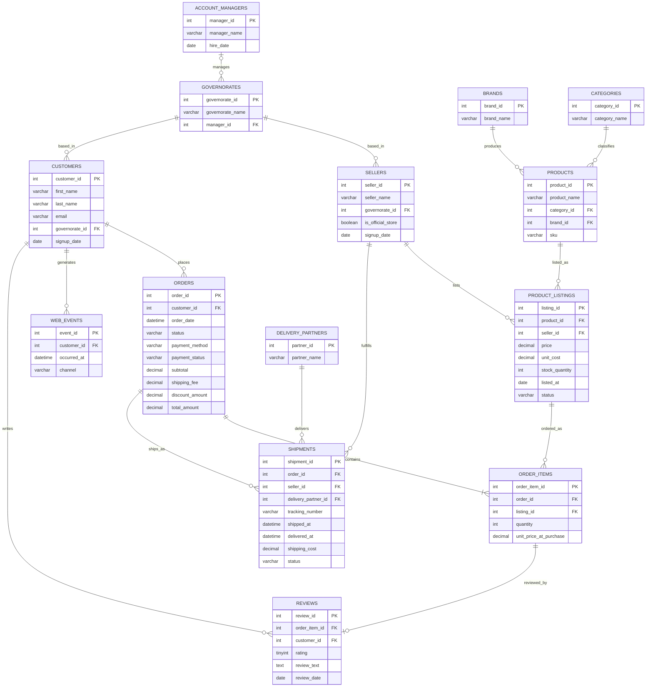

# Rawaj — ERD Diagram

See `rawaj_erd.md` for the full column list and design notes. This file is just the diagram.

```mermaid
erDiagram
    ACCOUNT_MANAGERS {
        int manager_id PK
        varchar manager_name
        date hire_date
    }
    GOVERNORATES {
        int governorate_id PK
        varchar governorate_name
        int manager_id FK
    }
    SELLERS {
        int seller_id PK
        varchar seller_name
        int governorate_id FK
        boolean is_official_store
        date signup_date
    }
    BRANDS {
        int brand_id PK
        varchar brand_name
    }
    CUSTOMERS {
        int customer_id PK
        varchar first_name
        varchar last_name
        varchar email
        int governorate_id FK
        date signup_date
    }
    CATEGORIES {
        int category_id PK
        varchar category_name
    }
    PRODUCTS {
        int product_id PK
        varchar product_name
        int category_id FK
        int brand_id FK
        varchar sku
    }
    PRODUCT_LISTINGS {
        int listing_id PK
        int product_id FK
        int seller_id FK
        decimal price
        decimal unit_cost
        int stock_quantity
        date listed_at
        varchar status
    }
    ORDERS {
        int order_id PK
        int customer_id FK
        datetime order_date
        varchar status
        varchar payment_method
        varchar payment_status
        decimal subtotal
        decimal shipping_fee
        decimal discount_amount
        decimal total_amount
    }
    ORDER_ITEMS {
        int order_item_id PK
        int order_id FK
        int listing_id FK
        int quantity
        decimal unit_price_at_purchase
    }
    WEB_EVENTS {
        int event_id PK
        int customer_id FK
        datetime occurred_at
        varchar channel
    }
    REVIEWS {
        int review_id PK
        int order_item_id FK
        int customer_id FK
        tinyint rating
        text review_text
        date review_date
    }
    DELIVERY_PARTNERS {
        int partner_id PK
        varchar partner_name
    }
    SHIPMENTS {
        int shipment_id PK
        int order_id FK
        int seller_id FK
        int delivery_partner_id FK
        varchar tracking_number
        datetime shipped_at
        datetime delivered_at
        decimal shipping_cost
        varchar status
    }

    ACCOUNT_MANAGERS |o--o{ GOVERNORATES : "manages"
    GOVERNORATES ||--o{ SELLERS : "based_in"
    GOVERNORATES ||--o{ CUSTOMERS : "based_in"
    SELLERS ||--o{ PRODUCT_LISTINGS : "lists"
    PRODUCTS ||--o{ PRODUCT_LISTINGS : "listed_as"
    CATEGORIES ||--o{ PRODUCTS : "classifies"
    BRANDS ||--o{ PRODUCTS : "produces"
    CUSTOMERS ||--o{ ORDERS : "places"
    ORDERS ||--|{ ORDER_ITEMS : "contains"
    PRODUCT_LISTINGS ||--o{ ORDER_ITEMS : "ordered_as"
    CUSTOMERS ||--o{ WEB_EVENTS : "generates"
    CUSTOMERS ||--o{ REVIEWS : "writes"
    ORDER_ITEMS ||--o| REVIEWS : "reviewed_by"
    ORDERS ||--o{ SHIPMENTS : "ships_as"
    SELLERS ||--o{ SHIPMENTS : "fulfills"
    DELIVERY_PARTNERS ||--o{ SHIPMENTS : "delivers"
```
