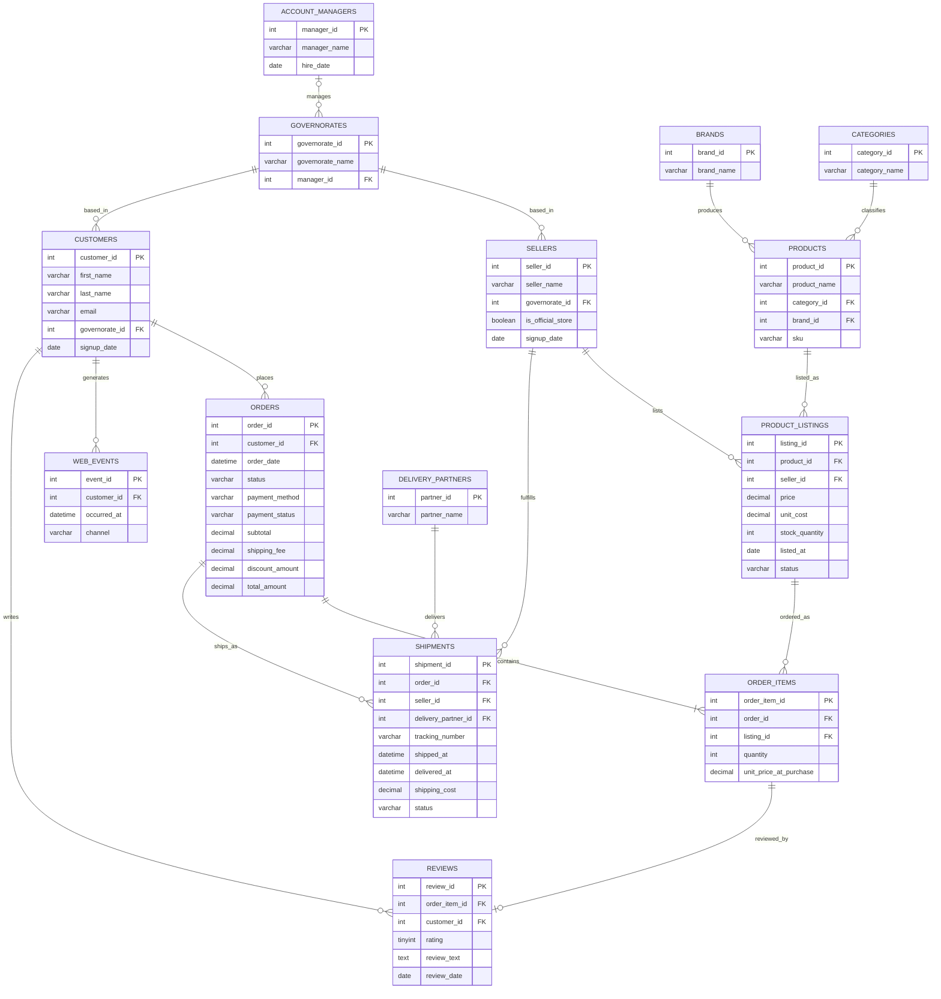

# Rawaj — Schema

The database behind Days 01–05 — a fictional Egyptian e-commerce marketplace, "Rawaj" (رواج —
"brisk trade/demand"), modeled after Jumia/Noon Egypt: third-party sellers list products,
individual customers buy them. See `rawaj_db.sql`.

## Concept

- **Sellers** are brand/shop accounts (e.g. `Samsung Egypt Official Store`, `El Fanous Electronics`,
  `Bela Fashion House`), not individuals — matching how Jumia/Noon sellers actually register.
  `is_official_store` distinguishes a verified brand store from a regular independent trader.
- **Rawaj is a true marketplace**: the same product can be listed by more than one seller, each at
  their own price/stock — modeled via `product_listings`, a bridge table between `products` and
  `sellers`. `order_items` references a specific listing, not a bare product.
- **`brands`** (Samsung, Nike, ...) are separate from `sellers` — who *makes* a product is not the
  same fact as who's *selling* it.
- **Customers** are individual Egyptian consumers (Egyptian first/last names).
- **Governorates** are Egyptian administrative regions: Cairo, Giza, Alexandria, Qalyubia, Sharqia,
  Assiut — shared by both sellers' home governorate and customers' governorate. One account manager
  can cover several governorates (`governorates.manager_id` is the FK, not the other way around).
- **Categories** mirror real Jumia/Noon categories: Electronics, Fashion, Home & Kitchen,
  Groceries, Health & Beauty, Baby & Kids — Egyptian flavor lives inside the categories (e.g.
  Egyptian grocery items, modest-wear fashion), not as separate invented categories.
- Currency: **EGP**.
- **Payment method matters here**: Cash on Delivery (COD) is the dominant real-world payment
  method in Egyptian e-commerce — `orders.payment_method` includes it alongside
  `credit_card`/`mobile_wallet`/`installment`, and `payment_status` is tracked separately from
  order `status` on purpose (a COD order can be `delivered` while still `payment_status = pending`
  until cash is actually collected — a genuine, teachable real-world nuance).
- **Shipping is modeled per (order, seller), not per order** — since a multi-seller order can have
  each seller's portion packed and dispatched independently (real marketplace behavior), one order
  can have multiple `shipments` rows, one per seller present in that order.
- Real-world realism baked in: messy `orders.status`, a genuine Ramadan/Eid order-volume spike in
  the date data, and several real sources of `NULL` (see below).

## Missing/NULL data (deliberate)

- `customers.email` — nullable (guest checkout)
- `reviews.review_text` — nullable (rated, no comment left)
- `shipments.delivered_at` — nullable (still in transit)
- `governorates.manager_id` — nullable (newly added governorate, no manager assigned yet)

## Join teaching examples this schema supports

| Business question | Join type |
|---|---|
| Customers who signed up but never ordered | LEFT JOIN / anti-join |
| Customers who browsed (web_events) but never converted | LEFT JOIN / anti-join |
| Sellers onboarded but haven't listed anything yet | LEFT JOIN / anti-join |
| Products in the catalog nobody currently sells | LEFT JOIN / anti-join |
| Purchases that were never reviewed | LEFT JOIN / anti-join |
| Orders with no shipment yet (pending/cancelled) | LEFT JOIN / anti-join |
| Couriers with zero deliveries so far | LEFT JOIN / anti-join |
| Governorates with no manager assigned | LEFT JOIN / anti-join |
| Customers who ordered vs. customers who generated a web_event (two independent optional relationships off the same parent) | FULL JOIN via UNION |

## Diagram

## Tables and columns

| Table | Column | Type | Notes |
|---|---|---|---|
| **account_managers** | `manager_id` PK | INT | |
| | `manager_name` | VARCHAR(100) | |
| | `hire_date` | DATE | |
| **governorates** | `governorate_id` PK | INT | |
| | `governorate_name` | VARCHAR(50) | Cairo, Giza, Alexandria, Qalyubia, Sharqia, Assiut |
| | `manager_id` FK→account_managers | INT | nullable; one manager can cover several governorates |
| **sellers** | `seller_id` PK | INT | |
| | `seller_name` | VARCHAR(150) | brand/shop name |
| | `governorate_id` FK→governorates | INT | seller's home governorate; manager reached via governorate |
| | `is_official_store` | BOOLEAN | |
| | `signup_date` | DATE | |
| **brands** | `brand_id` PK | INT | |
| | `brand_name` | VARCHAR(100) | UNIQUE |
| **categories** | `category_id` PK | INT | |
| | `category_name` | VARCHAR(50) | Electronics, Fashion, Home & Kitchen, Groceries, Health & Beauty, Baby & Kids |
| **products** | `product_id` PK | INT | |
| | `product_name` | VARCHAR(150) | |
| | `category_id` FK→categories | INT | |
| | `brand_id` FK→brands | INT | |
| | `sku` | VARCHAR(30) | |
| **product_listings** | `listing_id` PK | INT | one seller's offer of one product |
| | `product_id` FK→products | INT | |
| | `seller_id` FK→sellers | INT | UNIQUE together with `product_id` — one listing per seller per product |
| | `price` | DECIMAL(10,2) | this seller's price for this product |
| | `unit_cost` | DECIMAL(10,2) | this seller's cost basis |
| | `stock_quantity` | INT | |
| | `listed_at` | DATE | |
| | `status` | VARCHAR(20) | active/inactive/out_of_stock — a seller can pause a listing independent of stock |
| **customers** | `customer_id` PK | INT | |
| | `first_name`, `last_name` | VARCHAR(50) | Egyptian names |
| | `email` | VARCHAR(150) | nullable — some guest checkouts |
| | `governorate_id` FK→governorates | INT | |
| | `signup_date` | DATE | |
| **orders** | `order_id` PK | INT | |
| | `customer_id` FK→customers | INT | |
| | `order_date` | DATETIME | |
| | `status` | VARCHAR(20) | pending/processing/shipped/delivered/cancelled/returned |
| | `payment_method` | VARCHAR(20) | cash_on_delivery/credit_card/mobile_wallet/installment |
| | `payment_status` | VARCHAR(20) | pending/paid/failed/refunded — tracked separately from `status` |
| | `subtotal` | DECIMAL(10,2) | |
| | `shipping_fee` | DECIMAL(10,2) | |
| | `discount_amount` | DECIMAL(10,2) | |
| | `total_amount` | DECIMAL(10,2) | |
| **order_items** | `order_item_id` PK | INT | |
| | `order_id` FK→orders | INT | |
| | `listing_id` FK→product_listings | INT | which seller's listing was bought |
| | `quantity` | INT | |
| | `unit_price_at_purchase` | DECIMAL(10,2) | price snapshot at purchase time |
| **web_events** | `event_id` PK | INT | |
| | `customer_id` FK→customers | INT | |
| | `occurred_at` | DATETIME | |
| | `channel` | VARCHAR(30) | facebook/instagram/google/organic/direct |
| **reviews** | `review_id` PK | INT | |
| | `order_item_id` FK→order_items | INT | UNIQUE — at most one review per purchased item |
| | `customer_id` FK→customers | INT | denormalized; must equal the customer on the associated order (data-generation invariant, not DB-enforced) |
| | `rating` | TINYINT | 1–5 |
| | `review_text` | TEXT | nullable — some ratings have no comment |
| | `review_date` | DATE | |
| **delivery_partners** | `partner_id` PK | INT | fictional couriers, e.g. `Sarie3`, `Wasel Express` |
| | `partner_name` | VARCHAR(100) | |
| **shipments** | `shipment_id` PK | INT | one row per (order, seller) — a multi-seller order ships in parts |
| | `order_id` FK→orders | INT | |
| | `seller_id` FK→sellers | INT | which seller's portion of the order this covers |
| | `delivery_partner_id` FK→delivery_partners | INT | |
| | `tracking_number` | VARCHAR(50) | |
| | `shipped_at` | DATETIME | |
| | `delivered_at` | DATETIME | nullable — still in transit |
| | `shipping_cost` | DECIMAL(10,2) | |
| | `status` | VARCHAR(20) | pending/in_transit/delivered/returned/failed_delivery |

## Deliberately deferred (not part of the core schema)

Addresses, returns, coupons, wishlists, and product images were all considered and set aside to
keep the core teaching schema from ballooning — these could come back later as an optional/advanced
extension, but aren't needed for Days 02–05.

## Scale

`account_managers` 15 · `governorates` 6 · `brands` 40 · `categories` 6 · `delivery_partners` 6 ·
`sellers` 200 · `customers` 1,200 · `products` 400 · `product_listings` 607 · `orders` 6,000 ·
`order_items` 11,318 · `web_events` 9,000 · `reviews` 2,792 · `shipments` 9,242.
