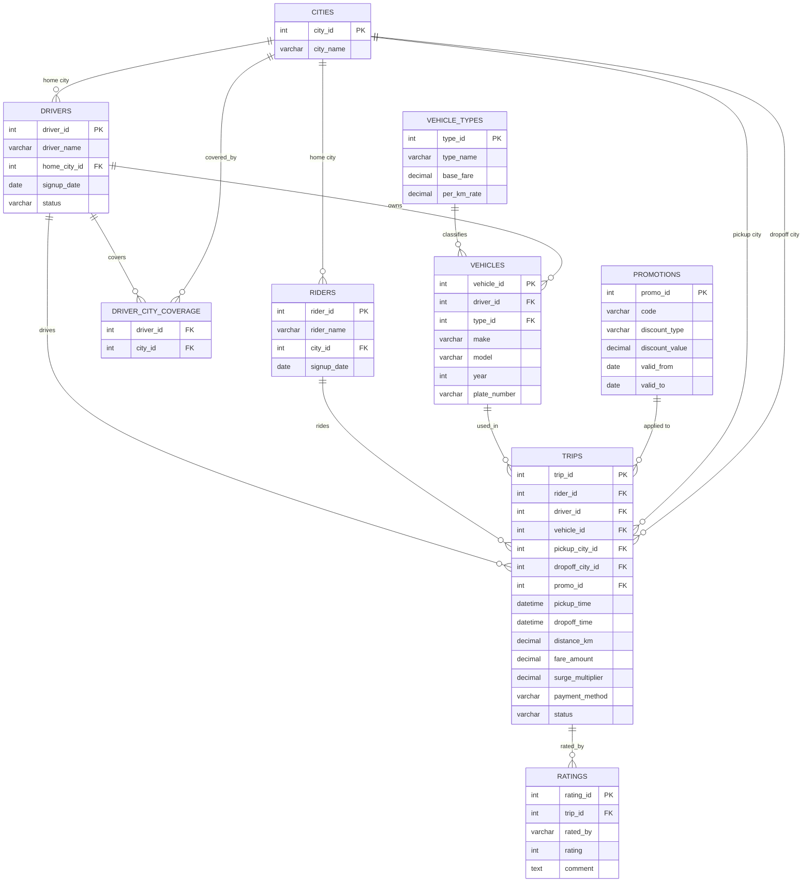

# Wasel — ERD Diagram

See `wasel_erd.md` for the full column list and design notes. This file is just the diagram.

```mermaid
erDiagram
    CITIES {
        int city_id PK
        varchar city_name
    }
    DRIVERS {
        int driver_id PK
        varchar driver_name
        int home_city_id FK
        date signup_date
        varchar status
    }
    RIDERS {
        int rider_id PK
        varchar rider_name
        int city_id FK
        date signup_date
    }
    DRIVER_CITY_COVERAGE {
        int driver_id FK
        int city_id FK
    }
    VEHICLE_TYPES {
        int type_id PK
        varchar type_name
        decimal base_fare
        decimal per_km_rate
    }
    VEHICLES {
        int vehicle_id PK
        int driver_id FK
        int type_id FK
        varchar make
        varchar model
        int year
        varchar plate_number
    }
    PROMOTIONS {
        int promo_id PK
        varchar code
        varchar discount_type
        decimal discount_value
        date valid_from
        date valid_to
    }
    TRIPS {
        int trip_id PK
        int rider_id FK
        int driver_id FK
        int vehicle_id FK
        int pickup_city_id FK
        int dropoff_city_id FK
        int promo_id FK
        datetime pickup_time
        datetime dropoff_time
        decimal distance_km
        decimal fare_amount
        decimal surge_multiplier
        varchar payment_method
        varchar status
    }
    RATINGS {
        int rating_id PK
        int trip_id FK
        varchar rated_by
        int rating
        text comment
    }

    CITIES ||--o{ DRIVERS : "home city"
    CITIES ||--o{ RIDERS : "home city"
    DRIVERS ||--o{ DRIVER_CITY_COVERAGE : covers
    CITIES ||--o{ DRIVER_CITY_COVERAGE : covered_by
    VEHICLE_TYPES ||--o{ VEHICLES : classifies
    DRIVERS ||--o{ VEHICLES : owns
    DRIVERS ||--o{ TRIPS : drives
    RIDERS ||--o{ TRIPS : rides
    VEHICLES ||--o{ TRIPS : used_in
    PROMOTIONS ||--o{ TRIPS : "applied to"
    CITIES ||--o{ TRIPS : "pickup city"
    CITIES ||--o{ TRIPS : "dropoff city"
    TRIPS ||--o{ RATINGS : rated_by
```
