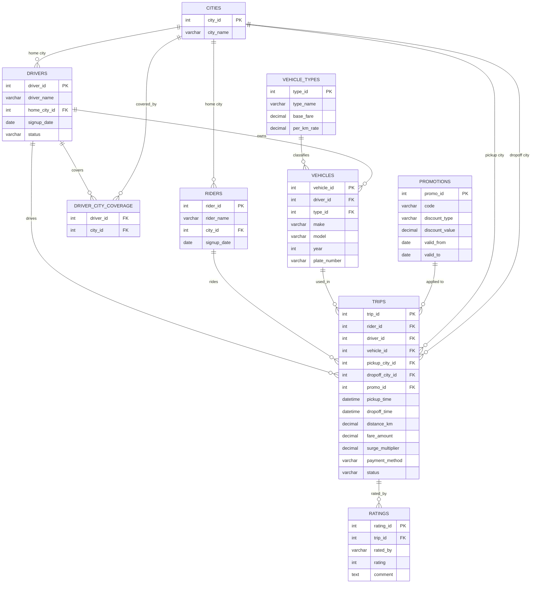

# Wasel — Schema

The database behind Day 07 — a fictional Egyptian ride-hailing app, "Wasel" (واصل — "arrived"),
continuing the same fictional Egyptian/MENA world as Rawaj. See `wasel.sqlite`.

## Concept

- **Cities**: Egyptian cities/governorates — Cairo, Giza, Alexandria, etc.
- **Drivers** have one home city, but can also cover additional nearby cities (Cairo/Giza/Qalyubia
  are practically one metro area) — a genuine many-to-many, via `driver_city_coverage`.
- **Vehicles** belong to exactly one driver (their own car, not a shared fleet) — a plain 1:N,
  not a bridge table.
- **Trips** are the transactional core — cross-city routes are common enough in Greater Cairo to
  be worth modeling explicitly, so a trip has both a `pickup_city_id` and a `dropoff_city_id`
  rather than one `city_id`.
- **Promotions** are optional per trip (most trips have none) — a nullable FK, not a bridge table,
  since one trip uses at most one promo code.
- **Ratings** mirror Rawaj's reviews — optional, with a nullable comment: some ratings have no
  comment left.

## What this schema is good for

- **Filtering and aggregation**: trips by city/date, average fare, filtering by status or payment
  method.
- **JOINs, CASE, anti-joins**: trips↔drivers↔riders↔vehicles↔cities joins; anti-joins like "drivers
  who never completed a trip"; CASE for surge/fare tiers.
- **Subqueries, CTEs, views**: top-earning drivers via a CTE; a saved "top 20 drivers by earnings"
  view.
- **Window functions**: ranking drivers by earnings within their home city, a running monthly trip
  count, month-over-month growth via `LAG`.

## Diagram

## Tables and columns

| Table | Column | Type | Notes |
|---|---|---|---|
| **cities** | `city_id` PK | INT | |
| | `city_name` | VARCHAR(50) | Cairo, Giza, Alexandria, ... |
| **drivers** | `driver_id` PK | INT | |
| | `driver_name` | VARCHAR(100) | |
| | `home_city_id` FK→cities | INT | |
| | `signup_date` | DATE | |
| | `status` | VARCHAR(20) | active/inactive |
| **riders** | `rider_id` PK | INT | |
| | `rider_name` | VARCHAR(100) | |
| | `city_id` FK→cities | INT | |
| | `signup_date` | DATE | |
| **driver_city_coverage** | `driver_id` FK→drivers | INT | genuine N:N — a driver can cover several cities |
| | `city_id` FK→cities | INT | |
| **vehicle_types** | `type_id` PK | INT | |
| | `type_name` | VARCHAR(30) | Economy/Comfort/XL |
| | `base_fare` | DECIMAL(10,2) | |
| | `per_km_rate` | DECIMAL(10,2) | |
| **vehicles** | `vehicle_id` PK | INT | |
| | `driver_id` FK→drivers | INT | one vehicle, one driver — plain 1:N |
| | `type_id` FK→vehicle_types | INT | |
| | `make`, `model` | VARCHAR(50) | |
| | `year` | INT | |
| | `plate_number` | VARCHAR(20) | |
| **promotions** | `promo_id` PK | INT | |
| | `code` | VARCHAR(30) | |
| | `discount_type` | VARCHAR(20) | percentage/fixed |
| | `discount_value` | DECIMAL(10,2) | |
| | `valid_from`, `valid_to` | DATE | |
| **trips** | `trip_id` PK | INT | |
| | `rider_id` FK→riders | INT | |
| | `driver_id` FK→drivers | INT | |
| | `vehicle_id` FK→vehicles | INT | |
| | `pickup_city_id` FK→cities | INT | |
| | `dropoff_city_id` FK→cities | INT | cross-city trips are common in Greater Cairo |
| | `promo_id` FK→promotions | INT | nullable — most trips have no promo |
| | `pickup_time`, `dropoff_time` | DATETIME | |
| | `distance_km` | DECIMAL(6,2) | |
| | `fare_amount` | DECIMAL(10,2) | |
| | `surge_multiplier` | DECIMAL(4,2) | |
| | `payment_method` | VARCHAR(20) | cash/card/mobile_wallet |
| | `status` | VARCHAR(20) | completed/cancelled/no_show |
| **ratings** | `rating_id` PK | INT | |
| | `trip_id` FK→trips | INT | |
| | `rated_by` | VARCHAR(10) | rider/driver — who left this rating |
| | `rating` | TINYINT | 1–5 |
| | `comment` | TEXT | nullable — some ratings have no comment |
