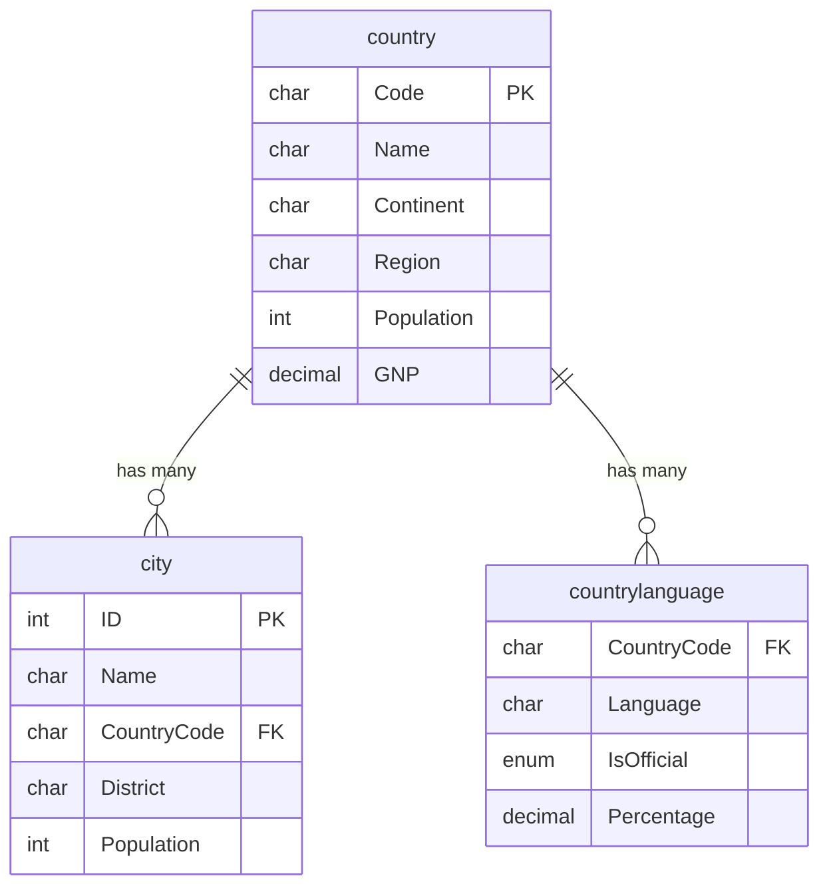

# Day 01 — SQL Foundations

> This reading covers the hands-on syntax (SELECT through ORDER BY). The conceptual foundations —
> what SQL/a database/DBMS is, relational vs. NoSQL, entity-relationship modeling, CRUD, MySQL —
> are covered in the slide deck (`Day 01 - SQL Foundations.pptx`) in this same folder. Start there,
> then come back here for the walkthrough.

## Before you start

Run `world_db.sql` once against your local MySQL server — it creates the `world` database and
loads it with data. Everything in this lesson queries that database, so nothing will work until
that script has run.

## The dataset

`world` is a small, classic MySQL sample database with three tables:

- **`country`** — one row per country (`Code`, `Name`, `Continent`, `Region`, `Population`,
  `SurfaceArea`, `LifeExpectancy`, `GNP`, `Capital`, ...)
- **`city`** — one row per city (`ID`, `Name`, `CountryCode`, `District`, `Population`) —
  `CountryCode` links back to `country.Code`
- **`countrylanguage`** — one row per (country, language) pair — which languages are spoken where,
  and what percentage of the population speaks each

This lesson mostly stays inside `country`. You'll bring in `city` and `countrylanguage` once JOINs
are introduced (Day 03) — for now, everything you need lives in a single table. Here's how the
three tables actually relate to each other:



## What a relational database actually is

A relational database stores data as **tables** — grids of rows and columns, like a spreadsheet,
but with strict rules about what type of data each column holds and how tables relate to each
other. A few rows of `country` actually look like this:

| Code | Name        | Continent | Population |
|------|-------------|-----------|------------|
| EGY  | Egypt       | Africa    | 68470000   |
| USA  | United States | North America | 278357000 |
| FRA  | France      | Europe    | 59225700   |

MySQL is the software (a "database engine") that stores those tables on disk and answers questions
about them. **SQL** (Structured Query Language) is the language you use to ask those questions —
it isn't specific to MySQL, though every engine has its own small dialect quirks (you'll see
MySQL-specific syntax called out as it comes up).

A MySQL **server** can hold many **databases** (`world` is one; `parch_and_posey`, which you'll use
starting Day 02, is another). `SHOW DATABASES;` lists every database the server knows about;
`USE world;` tells MySQL "for the rest of this session, assume I mean this database" so you don't
have to prefix every table name.

## Anatomy of a SELECT

Every query in this lesson has the same skeleton:

```sql
SELECT <columns>
FROM <table>
[WHERE <condition>]      -- not yet — Day 02
ORDER BY <column>
LIMIT <count>;
```

`SELECT *` means "give me every column." Listing columns explicitly (`SELECT Region, Continent,
Name`) is almost always better in real work — it's clearer what the query returns, and it doesn't
silently break if someone adds a column to the table later.

## LIMIT and OFFSET

`LIMIT` caps how many rows come back. `OFFSET` skips a number of rows before starting to return
results — the combination is how you'd implement "page 2 of results" in an application.

MySQL has two ways to write the same thing:

```sql
LIMIT 3 OFFSET 2;   -- standard SQL: return 3 rows, after skipping 2
LIMIT 2, 3;         -- MySQL shortcut: LIMIT skip, count — same result
```

Picture an 8-row table — both queries above skip the first 2 rows, then return the next 3:

```
 row1   row2  │  row3   row4   row5  │  row6   row7   row8
[ skip ][skip]│ [ take ][ take ][take]│ [  ..  ][  ..  ][  ..  ]
 └── OFFSET 2 ──┘└──────── LIMIT 3 ────┘
```

The shortcut form is easy to misread (is the first number the skip or the count?), so most people
default to the `OFFSET` form for anything they'll hand to someone else, and only reach for the
shortcut out of habit once it's second nature.

## DISTINCT

`SELECT DISTINCT Region FROM country;` collapses duplicate values in the result down to one row
each. Without `DISTINCT`, you'd get one row *per country* — `Asia`, `Asia`, `Asia`, ... repeated for
every Asian country. `DISTINCT` answers "what are the possible values?" instead of "what's the
value for each row?".

## Aggregation: COUNT

`COUNT` is your first **aggregate function** — instead of returning one row per input row, it
collapses many rows into a single summary number.

- `COUNT(*)` counts every row, full stop.
- `COUNT(Code)` counts only rows where `Code` is *not* `NULL` — with a single column this rarely
  differs from `COUNT(*)`, but the distinction matters a lot once a column can be missing.
- `COUNT(DISTINCT Region)` combines both ideas: count how many *unique* values a column has.

## Aliasing with AS

`AS` renames a result column: `COUNT(*) AS CNTRY_CNT` labels the output column `CNTRY_CNT` instead
of the default `COUNT(*)`. `AS` is optional — `COUNT(*) CNTRY_CNT` works identically — but writing
it out is usually clearer to read.

## ORDER BY

`ORDER BY` sorts the result. `ASC` (ascending — the default, so it's rarely written) and `DESC`
(descending) control direction. You can sort by a column that isn't even in your `SELECT` list, and
you can combine `ORDER BY` with `LIMIT` to answer "top N" questions — that's exactly what "top 5
countries by population" is doing in the walkthrough.
