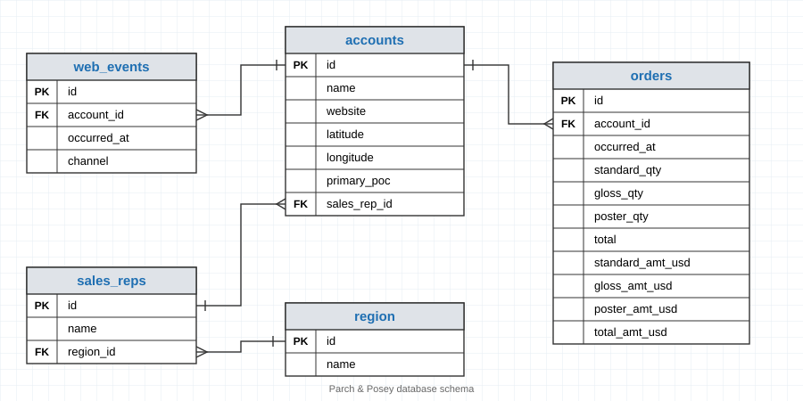
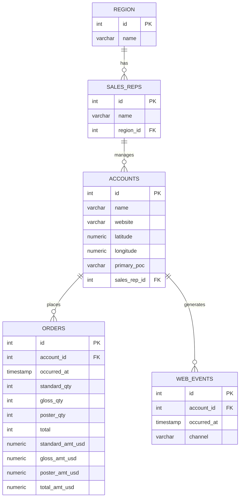

# Parch & Posey Database 

**Parch and Posey** is a fictional company that specializes in selling paper products. 
- They have 50 sales representatives spread across the United States, organized into four regions.
- Parch and Posey offers three types of paper: standard, poster, and glossy.
- Their primary clients are large Fortune 100 companies, attracted through advertising on Google, Facebook, and Twitter.

**Note:** 

Parch and Posey is not a real company; it's originaly fabricated for educational purposes by the Udacity SQL for Data Analysis course creator to simulate real-world business problems. We modified it for this course to be compatible with MySQL.

## Relationships

- One **region** has many **sales_reps** (1:N)
- One **sales_rep** manages many **accounts** (1:N)
- One **account** places many **orders** (1:N)
- One **account** generates many **web_events** (1:N)

