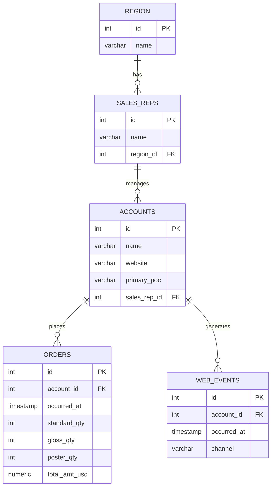

# Day 02 — Filtering & Aggregation

## Before you start

Run `Parch & Posey Database.sql` once against your local MySQL server — it creates the
`parch_and_posey` database and loads it with data. Then `USE parch_and_posey;` at the top of your
session, same as Day 01's `USE world;`.

## The dataset

Parch & Posey is a fictional paper-sales company: 50 sales reps across 4 regions, selling standard,
poster, and glossy paper to large clients, advertised through Google/Facebook/Twitter. Five tables,
chained together:



This is a **chain of 1:N relationships** — one region has many sales reps, one sales rep manages
many accounts, one account places many orders and generates many web events. You won't need JOINs
to query any single table in this lesson (that's Day 03), but keep this shape in mind — it's why
`account_id` shows up as a column on both `orders` and `web_events`. See `Parch_and_Posey.md` for
the full column list per table.

## Quick review: Day 01 concepts on a new dataset

The walkthrough opens with LIMIT/OFFSET, DISTINCT, and ORDER BY again — same syntax as Day 01,
just against `orders`, `web_events`, and `accounts` instead of `country`. If any of that feels
unfamiliar, revisit Day 01 before continuing; this lesson builds on it rather than re-explaining it.

## WHERE — filtering rows

`WHERE` narrows which rows a query returns, evaluated *before* `SELECT`/`ORDER BY`/`LIMIT` do
anything:

```sql
SELECT *
FROM orders
WHERE total_amt_usd > 100000
ORDER BY total_amt_usd DESC;
```

Comparison operators work as you'd expect: `=`, `>`, `<`, `>=`, `<=`. Not-equal has two spellings —
`!=` and `<>` (standard SQL) — plus a third way using `NOT`: `WHERE NOT account_id = 1001`. All
three are equivalent; `!=` is the one you'll see most often in practice.

## AND / OR — combining conditions

| | Facebook only | account 1001 only |
|---|---|---|
| **AND** (both must hold) | ✓ | ✓ |
| **OR** (either can hold) | ✓ | ✓ |

`WHERE channel = 'facebook' AND account_id = 1001` returns rows matching *both* conditions —
Facebook events, and only for that one account. Swap `AND` for `OR` and the same query returns
every Facebook event from *any* account, plus every event (any channel) from account 1001 — a much
bigger, looser result set. Mixing up `AND`/`OR` is one of the most common real-world SQL bugs,
precisely because both are grammatically valid in the same spot but change the result drastically.

## BETWEEN — range filtering

```
        500                                    999
         │═══════════════════════════════════════│
 ────────┼─────────────────────────────────────────┼──────►  total_amt_usd
       excluded            BETWEEN 500 AND 999    excluded
```

`WHERE total_amt_usd BETWEEN 500 AND 999` is shorthand for `WHERE total_amt_usd >= 500 AND
total_amt_usd <= 999` — **both endpoints are inclusive**. `BETWEEN` also works on dates:
`WHERE occurred_at BETWEEN '2014-12-30' AND '2015-01-01'`.

## IN vs OR

`WHERE channel = 'facebook' OR channel = 'twitter' OR channel = 'organic'` and
`WHERE channel IN ('facebook', 'twitter', 'organic')` return identical results — `IN` is just a
cleaner way to write "equals one of these values" once you're past two or three options.

## NULL checks

`NULL` means "no value recorded" — it isn't `0`, isn't `''`, and ordinary `=` can't test for it
(`WHERE x = NULL` silently matches nothing). Use `IS NULL` / `IS NOT NULL` instead. Parch & Posey
happens to have no NULLs anywhere, so `WHERE primary_poc IS NULL` returns 0 rows here — the syntax
is still exactly what you'd reach for on a real, messier dataset.

## LIKE — pattern matching

Two wildcards: `%` matches any number of characters (including zero), `_` matches exactly one.

| Pattern | Matches |
|---|---|
| `'A%'` | starts with A |
| `'%a%'` | contains a, anywhere |
| `'_a%'` | 'a' is the 2nd character |
| `'_a___'` | exactly 5 characters, 'a' 2nd |
| `'%ct'` | ends with 'ct' |

## GROUP BY — aggregating per bucket

Aggregate functions (`COUNT`, `SUM`, `AVG`, `MIN`, `MAX`) collapse *all* matching rows into one
number, unless you tell them to collapse separately per group:

```
web_events.channel:    direct  facebook  direct  twitter  facebook  direct
                          │        │        │        │        │        │
                          ▼        ▼        ▼        ▼        ▼        ▼
GROUP BY channel:     ┌─────────────────┐ ┌──────────────────┐ ┌─────────┐
                      │  direct  (×3)   │ │  facebook  (×2)  │ │ twitter │
                      └─────────────────┘ └──────────────────┘ │  (×1)   │
                                                                 └─────────┘
```

```sql
SELECT channel, COUNT(*) AS cnt
FROM web_events
GROUP BY channel;
```

Every column in `SELECT` that *isn't* wrapped in an aggregate function must appear in `GROUP BY` —
MySQL is lenient about enforcing this compared to some other databases, but the logic still applies:
one output row per unique combination of the `GROUP BY` columns. Group by more than one column
(`GROUP BY account_id, channel`) to get one row per *combination* — e.g. this account, that channel.

## DATE functions

MySQL pulls pieces out of a `TIMESTAMP` with dedicated functions: `YEAR()`, `MONTH()`, `DAY()`,
`HOUR()`, `DATE()` (strips the time, keeps the date), `MONTHNAME()`, `DAYNAME()`. Three
different ways to get "just the year" all return the same thing — `YEAR(occurred_at)`,
`EXTRACT(YEAR FROM occurred_at)`, `DATE_FORMAT(occurred_at, '%Y')` — pick whichever reads clearest;
`YEAR()` usually does. `DATE_ADD(date, INTERVAL n DAY)` shifts a date forward (or back, with a
negative interval) — handy for things like "expected delivery = order date + 7 days." See
`dates_specifiers.jpg` in this folder for the full `DATE_FORMAT` specifier reference (`%Y`, `%m`,
`%d`, etc.).

`CURDATE()` and `NOW()` give you today's date and the current date+time, useful whenever a query
needs to reason about "right now" rather than a value stored in a row.
