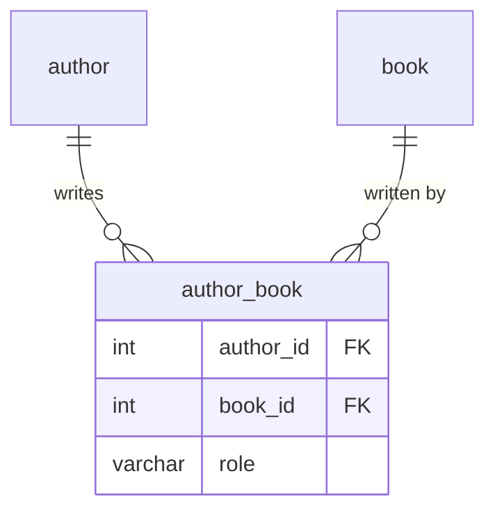

# Day 03 — JOINs + CASE

## Before you start

Run Day 02's `Parch & Posey Database.sql` first if you haven't already — this lesson uses the same
`parch_and_posey` database, now bringing all five tables together instead of querying one at a time.

## From relationship types to JOIN syntax

Day 01 introduced three relationship types — 1:1, 1:N, N:N — using a primary key/foreign key pair.
Here's the connecting idea: **JOIN is the SQL operation that follows a foreign key back to the row
it points to.** Every relationship type from Day 01 is just a different pattern of JOINs:

- **1:N** (region → sales_reps, sales_reps → accounts, accounts → orders/web_events) — a single
  `JOIN ... ON child.fk = parent.id`. This is everything in `parch_and_posey` and everything in
  this lesson.
- **N:N** (Day 01's book ↔ author example) — needs a *junction table* in the middle
  (`author_book`), joined twice: `book JOIN author_book ON ... JOIN author ON ...`. Not used in
  this dataset, but worth recognizing the shape if you see it elsewhere.



## Anatomy of a JOIN

```sql
SELECT <columns>
FROM <left_table>
JOIN <right_table>
    ON <left_table>.<fk_column> = <right_table>.<pk_column>;
```

`ON` is the join condition — it tells MySQL which rows from each table belong together. Get it
wrong (or omit it) and you get a **cross join**: every row of the left table paired with every row
of the right table, which for `orders` × `accounts` would be millions of nonsense rows. Table
aliases (`FROM orders o JOIN accounts a`) exist because real queries reference the same table names
repeatedly — `o.account_id = a.id` is a lot less noisy than spelling out `orders.account_id =
accounts.id` every time, especially once you're joining three or four tables.

## INNER JOIN vs LEFT/RIGHT JOIN

Plain `JOIN` (short for `INNER JOIN`) only returns rows that match on *both* sides. `LEFT JOIN`
keeps every row from the left table regardless of whether a match exists — unmatched columns from
the right table come back `NULL`. `RIGHT JOIN` is the mirror image.

```
INNER JOIN                    LEFT JOIN
┌──────────┐                  ┌──────────┐
│ accounts │                  │ accounts │
│  ┌───────┼──┐               │  ┌───────┼──┐
│  │ match │  │  orders       │██│ match │  │  orders
│  └───────┼──┘               │██└───────┼──┘
└──────────┘                  └──────────┘
only the overlap           ALL of accounts, matched
returned                   or not (NULLs where no order)
```

This is exactly how you'd answer "which accounts have never placed an order?" — `LEFT JOIN` from
`accounts` to `orders`, then `WHERE orders.id IS NULL` keeps only the rows where nothing on the
right side matched. This pattern is sometimes called an **anti-join**.

MySQL doesn't have a `FULL JOIN` keyword (some other databases do). To get "everything from both
sides, matched or not," `UNION` a `LEFT JOIN` with a `RIGHT JOIN` — the walkthrough has the exact
pattern.

## HAVING — filtering on the aggregated result

`WHERE` filters rows *before* grouping; `HAVING` filters groups *after* aggregation, because things
like `COUNT(*)` or `SUM(total_amt_usd)` don't exist yet at the point `WHERE` runs:

```sql
SELECT s.name, COUNT(*) AS num_accounts
FROM accounts a
JOIN sales_reps s ON s.id = a.sales_rep_id
GROUP BY s.name
HAVING COUNT(*) > 5;        -- WHERE COUNT(*) > 5 would be a syntax error here
```

## CASE — conditional logic inside a query

```sql
CASE
    WHEN <condition_1> THEN <result_1>
    WHEN <condition_2> THEN <result_2>
    ELSE <fallback>
END AS <column_alias>
```

Conditions are checked top to bottom — the first one that's true wins, and the rest are skipped
(so order matters when ranges could overlap). `ELSE` is optional; without it, rows that hit no
`WHEN` come back `NULL` instead of a fallback value. `CASE` works anywhere an expression can go:
in `SELECT` to label rows, wrapped in an aggregate (`SUM(CASE WHEN ... THEN 1 ELSE 0 END)` is a
conditional count), or referenced in `GROUP BY`/`HAVING`/`ORDER BY` by its alias.

A `CASE` inside `SUM()`/aggregates is how you bucket continuous values (order totals, account
lifetime spend) into discrete tiers — 'top'/'middle'/'low' — for reporting, without a separate
lookup table.
